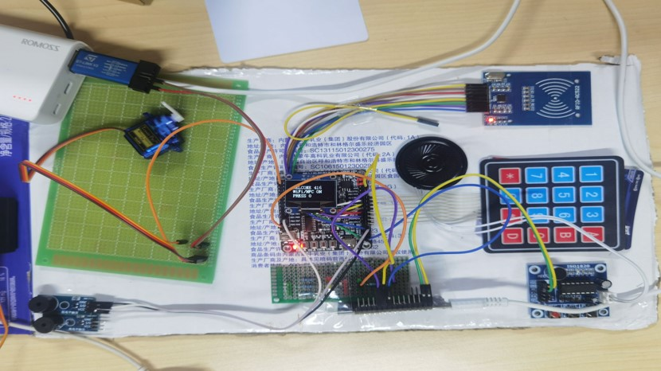

前言：
已有Gitee的网友复刻成功。成本极低！适合各种项目以及个人的学习！各位有需要可以尝试！     
另外感谢各位对项目的参与！！！！   
# ESP8266_STM32_门禁_v1.0    
宿舍可使用的简易门禁系统,支持WiFi 门禁卡 以及密码 三种开门方式.    
STM32_ESP8266_MainCode烧录到STM32F103(RCT6)开发板    
simplest_led通过Arduino烧录到ESP8266开发板    
使用MDK以及Arduino开发     

其实只用一个ESP8266即可完成该项目.但由于开发时不太会Arduino和不熟悉ESP...所以用了STM的芯片作为主控..如果不使用8266的话去使用较小的ESP-01S也是可以的.esp在此项目中只起到wifi控制的作用.
该项目将在Github由本人开源持续完善,争取在我大四时让他成为可用且好用的状态.    

## 项目器材
主控芯片:STM32F103RCT6    
WIFI模块:ESP8266 NodeMCU Lua V3 物联网开发板    
IC模块:MFRC-RC522 模块    
电源模块：使用充电宝microUSB口为主控芯片和wifi模块等供电,建议为舵机提供单独电源,在此暂时使用ST-LINK v2下载器为舵机单独供电。    
其余配件:ISD1820语音模块(可有可无) 9g舵机 有源蜂鸣器 薄膜键盘 0.96寸OLED显示屏(四线)等      
         

## 系统工作流程
开门方式有三种: 密码开门、NFC开门、以及WIFI开门。    
开门方式系统模拟表现为舵机转动 90°后转回，具体后期实际应用方面再做调整。    
输入密码进入主菜单的ATTENDANT（管理员模式）后可以修改密码，添加或者删除NFC卡片。     
ISD1820语音模块可以实现简单的语音留言功能。     

## 接线到stm32
RC522_ENABLE  	PA4    
RC522_RESET 	PC2     
RC522_SCK 	PA2    
RC522_MOSI 	PA0    
RC522_MISO_GET 	PA6    
RC522_IRQ 	程序未使用    
ESP8266_D4 	PB8 (可串联电阻,效果略好,当然也可以无视)    
ESP8266_3V	3.3 (在此使得两系统板共电源)    
ESP8266_GND	GND    
蜂鸣器IO		PB5    
0.96'OLED	GND 3.3 SCL SDA    
舵机PWM		PB11(舵机应单独供电,不应接系统板取电,实测抖动较大)    
4*4键盘		PC13 PC15 PC1 PC3 PA1 PA3 PA5 PA7    

## 主要参考以及联系方式
RC522官方程序    
https://github.com/Mixiaoxiao/Arduino-HomeKit-ESP8266    
以及正点原子等各种技术文件    
作者Email sunjiyi666@foxmail.com技术问题可咨询,转载请标明出处.   
作者b站主页:https://space.bilibili.com/37767944?spm_id_from=333.1007.0.0  

### 本项目来源于学校小电子比赛,项目荣获了一等奖,在此感谢参考到的开源项目作者们.  
